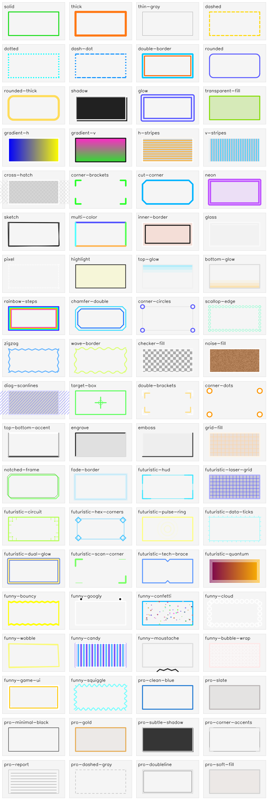

# 🖼️ drawcv — Stylish Bounding Boxes for OpenCV

<p align="center">
  
</p>

<p align="center">
  <a href="https://pypi.org/project/drawcv/"></a>
  <a href="LICENSE"></a>
  
  
</p>

> Drop-in upgrade for `cv2.rectangle()` — turn plain bounding boxes into polished, production-ready detection overlays with a single function call.

---

## ✨ What is drawcv?

`drawcv` is a lightweight Python library that replaces OpenCV's bare-bones bounding rectangles with a collection of **modern, styled frames** ready for demos, dashboards, and detection pipelines. It works directly on `numpy` arrays using OpenCV under the hood, so it fits seamlessly into any existing workflow.

**One line change. Dramatically better visuals.**

---

## 📦 Installation

```bash
pip install drawcv
```

---

## 🚀 Quick Start

```python
import cv2
from drawcv import drawcv

image = cv2.imread("resource/test.png")

drawcv(
    image=image,
    style_id="pro-clean-blue",   # style name or index (0, 1, 2…)
    coords=(80, 60, 280, 220),   # (x1, y1, x2, y2)
)

cv2.imwrite("output.jpg", image)
```

---

## 🔁 Migration from Plain OpenCV

If you're already using `cv2.rectangle`, switching takes seconds:

### Before
```python
cv2.rectangle(image, (x1, y1), (x2, y2), (0, 255, 0), 2)
```

### After
```python
from drawcv import drawcv

drawcv(
    image=image,
    style_id="pro-clean-blue",
    coords=(x1, y1, x2, y2),
)
```

### With Optional Color & Line Width Override
```python
drawcv(
    image=image,
    style_id="futuristic-hud",
    coords=(x1, y1, x2, y2),
    color=(255, 255, 255),   # BGR color override
    line_width=1,
)
```

---

## 🎨 Available Styles

List all available styles programmatically:

```python
from drawcv import list_visionframe_styles

styles = list_visionframe_styles()
print(styles)
```

Styles can be referenced by **name** (e.g. `"futuristic-hud"`) or by **index** (e.g. `0`, `1`, `2`).

### Generate the Style Gallery

```python
import cv2
from drawcv import create_visionframe_gallery

gallery = create_visionframe_gallery()
cv2.imwrite("resource/visionframe_styles_gallery.png", gallery)
```

---

## 🔧 API Reference

### `drawcv(image, style_id, coords, color=None, line_width=None)`

| Parameter | Type | Description |
|-----------|------|-------------|
| `image` | `np.ndarray` | OpenCV image (BGR, modified in-place) |
| `style_id` | `str` or `int` | Style name or index from `list_visionframe_styles()` |
| `coords` | `tuple` | Bounding box as `(x1, y1, x2, y2)` |
| `color` | `tuple` (optional) | BGR color override `(B, G, R)` |
| `line_width` | `int` (optional) | Line thickness override |

### `list_visionframe_styles() → list[str]`
Returns a list of all available style names.

### `create_visionframe_gallery() → np.ndarray`
Generates a preview gallery image of all available styles.

---

## 🏗️ Project Structure

```
visionframe/
├── src/            # Library source code
├── tests/          # Pytest test suite
├── resource/       # Sample images and gallery output
├── setup.py
├── pyproject.toml
└── requirements-dev.txt
```

---

## 🛠️ Local Development

```bash
# Create and activate virtual environment
python -m venv .venv
.venv\Scripts\activate       # Windows
# source .venv/bin/activate  # Linux/macOS

# Install in editable mode with dev dependencies
pip install -e .[dev]
```

### Run Tests

```bash
pytest
```

### Build Package

```bash
python -m build
```

---

## 📋 Requirements

- Python 3.8+
- `opencv-python`
- `numpy`

---

## 📄 License

This project is licensed under the [MIT License](LICENSE).

---

## 🤝 Contributing

Contributions are welcome! Feel free to open an issue or submit a pull request for new styles, bug fixes, or improvements.

1. Fork the repository
2. Create a feature branch (`git checkout -b feature/new-style`)
3. Commit your changes (`git commit -m 'Add new frame style'`)
4. Push and open a Pull Request

---

<p align="center">Made with ❤️ for the computer vision community</p>